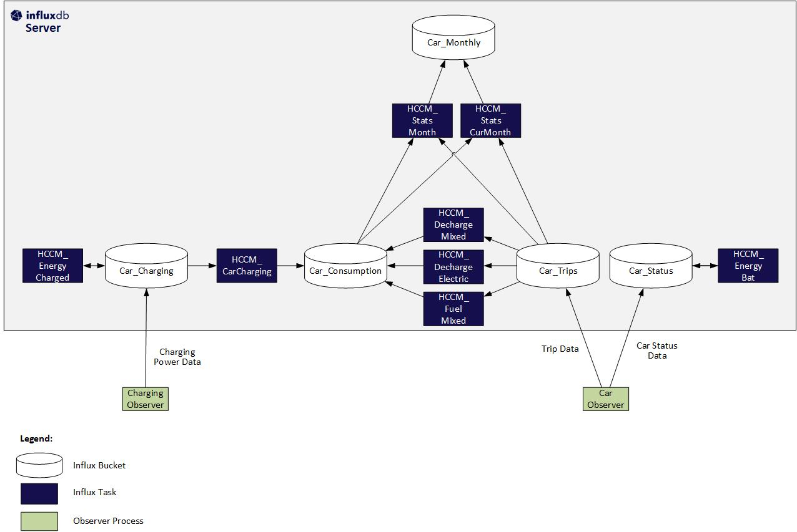

# Creation of Influx Tasks

Transformation of raw data obtained from Charging Observer and Car Observer (see [Architecture](architecture.md)) into structures used for evaluation is done through Influx **Tasks**.
These tasks run on specific schedules. They read data from input buckets and write transformed data to output buckets.
For more information on the data schema for the different buckets, see [Data Schema for Influx DB Buckets](./influxDBDataSchema.md)

## Overview

The following diagram shows all tasks with their related buckets.



## Task Creation

Under ```./influx/JsonImports````, JSON files for all tasks can be found for import as Influx Tasks.

| Step | Action
|------|-------
| 1.   | In the Influx UI, open the **Tasks** page
| 2.   | Push button ```+ CREATE TASK```<br/>Then select ```Import Task```
| 3.   | Navigate to the directory ```./influx/JsonImports``` and select the task to be imported<br/>Then press ```IMPORT JSON AS TASK```
| 4.   | After the import has been completed, deactivate the task.<br/>This is recomended because the task will fail because a necessary variable is not yet set
| 5.   | Repeat steps 1-4 for all tasks
| 6.   | Each task must now be edited in order to set the Vehicle Identification Number (vin) of the car<br/>```// !!! XXXXXXXXXXXXXXXXX ! Specify Vecicle Identification Number here !!!!!!!!!!!!!!!!!```<br/>```vin = "XXXXXXXXXXXXXXXXX"```
| 7.   | For ```HCCM_EnergyBat``` also the HV Battery capacity must be adjusted
| 8.   | After having saved the task, it can be activated.<br/>It is also recommended to run the task in order to check that execution does not fail.<br/>Note that some tasks may fail if the associated source buckets do not yet contain data.
