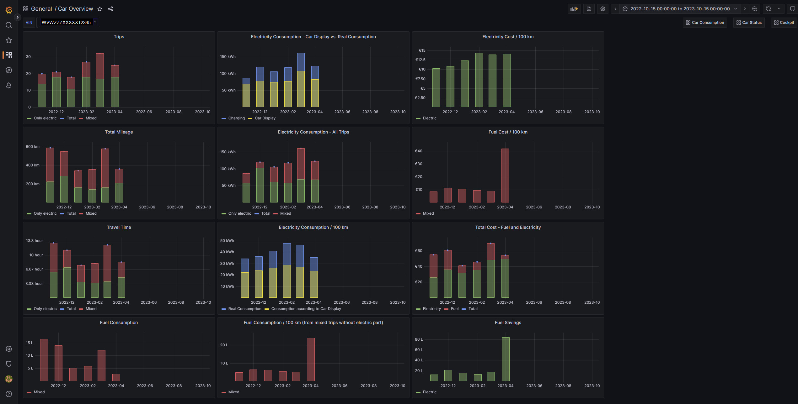
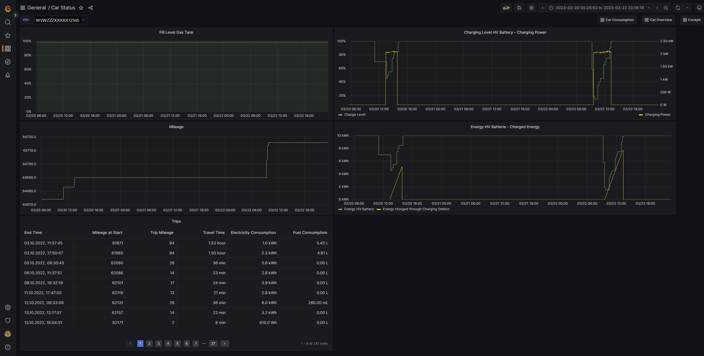
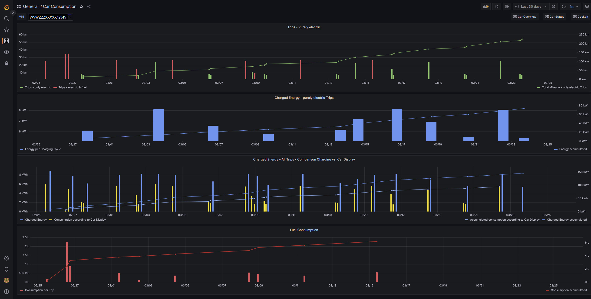
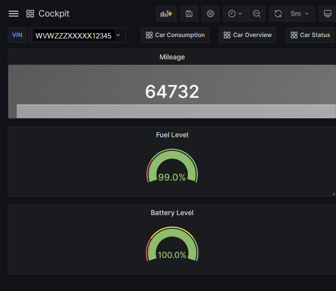

# Hybrid Car Consumption Vizualization

Here is a short description of dashboards for the Hybrid-Car-Consumption-Monitor
in case that
- [Hybrid Car Consumption Vizualization](#hybrid-car-consumption-vizualization)
  - [Car Overview](#car-overview)
    - [Selector: VIN](#selector-vin)
    - [Panel: Trips](#panel-trips)
    - [Panel: Total Mileage](#panel-total-mileage)
    - [Panel: Travel Time](#panel-travel-time)
    - [Panel: Fuel Consumption](#panel-fuel-consumption)
    - [Panel: Electricity Consumption - Car Display vs. Real Consumption](#panel-electricity-consumption---car-display-vs-real-consumption)
    - [Panel: Electricity Consumption - All Trips](#panel-electricity-consumption---all-trips)
    - [Panel: Electricity Consumption / 100 km](#panel-electricity-consumption--100-km)
    - [Panel: Fuel Consumption / 100 km (from mixed trips without electric part)](#panel-fuel-consumption--100-km-from-mixed-trips-without-electric-part)
    - [Panel: Electricity Cost / 100 km](#panel-electricity-cost--100-km)
    - [Panel: Fuel Cost / 100 km](#panel-fuel-cost--100-km)
    - [Panel: Total Cost - Fuel and Electricity](#panel-total-cost---fuel-and-electricity)
    - [Panel Fuel Savings](#panel-fuel-savings)
  - [Car Status](#car-status)
    - [Selector: VIN (Car Status)](#selector-vin-car-status)
    - [Panel: Fill Level Gas Tank](#panel-fill-level-gas-tank)
    - [Panel: Mileage](#panel-mileage)
    - [Panel: Charging Level HV Battery - Charging Power](#panel-charging-level-hv-battery---charging-power)
    - [Panel: Ebergy HV Battery - Charged Energy](#panel-ebergy-hv-battery---charged-energy)
    - [Panel: Trips (Car Status)](#panel-trips-car-status)
  - [Car Consumption](#car-consumption)
    - [Selector: VIN (Car Consumption)](#selector-vin-car-consumption)
    - [Panel: Trips - Purely electric](#panel-trips---purely-electric)
    - [Panel: Charged Energy - purely electric Trips](#panel-charged-energy---purely-electric-trips)
    - [Panel: Charged Energy - All Trips - Comparison Charging vs. Car Display](#panel-charged-energy---all-trips---comparison-charging-vs-car-display)
    - [Panel: Fuel Consumption (Car Consumption)](#panel-fuel-consumption-car-consumption)
  - [Car Cockpit](#car-cockpit)
    - [Selector: VIN (Car Cockpit)](#selector-vin-car-cockpit)
    - [Panel: Mileage (Car Cockpit)](#panel-mileage-car-cockpit)
    - [Panel: Fuel Level](#panel-fuel-level)
    - [Panel: Battery Level](#panel-battery-level)

## Car Overview

This dashboard shows various KPIs on a monthly base.
Note that synchronization of x-axis labels with monthly bars is shifted by one month because of a lack of x-axis formatting capabilities in Grafana.

### Selector: VIN

Allows selecting the car's Vehicle Identification Number, in case that the database contains data for multiple cars.

### Panel: Trips

Shows the number of trips per month as stacked bars differentiated by purely electric trips without fuel consumption (green) and mixed trips with fuel consumption (red)

### Panel: Total Mileage

Shows the total mileage per month as stacked bars differentiated by purely electric (green) and mixed (red) trips.

### Panel: Travel Time

Shows the total traveling time per month as stacked bars differentiated by purely electric (green) and mixed (red) trips.

### Panel: Fuel Consumption

Shows the total fuel consumption per month.

### Panel: Electricity Consumption - Car Display vs. Real Consumption

This panel shows the consumption of electricity per month as overlapping bars.
The yellow bars represent the consumption according to car display, as received from the manufacturers cloud services.
The blue bars represent the consumption according to charging. This is the real consumption.

### Panel: Electricity Consumption - All Trips

This panel shows the entire electricity consumption per month as stacked bars differentiated by purely electric  (green) and mixed trips (red).
Source is the real consumption determined from charging rather than from car display.

### Panel: Electricity Consumption / 100 km

This is the normalized electricity consumption.
This is determined from all charging cycles within a month where all preceeding trips were purely electric.
Using this together with the mileage of these trips, the real normalized electricity consumption can be calculated.

### Panel: Fuel Consumption / 100 km (from mixed trips without electric part)

Fuel consumption per month is determined from all mixed trips, having fuel and electricity consumption.
The mileage for these trips is reduced by the mileage which would have been covered with electric drive only. This is determined from the electricity consumed for the mixed trips and the normalized electricity consumption (see above).

Note that abnormously high fuel consumption may be shown in months where the engine has only been used during very short periods.

### Panel: Electricity Cost / 100 km

This panel shows the real cost for electricity for 100 km, considering the [Electricity Price](./specifyPrices.md) specified on a monthly base.

### Panel: Fuel Cost / 100 km

This panel shows the real cost for fuel for 100 km, considering the [Fuel Price](./specifyPrices.md) specified on a monthly base.

### Panel: Total Cost - Fuel and Electricity

Shows the total cost per month as stacked bars differentiated by cost for electricity (green) and fuel (red).

### Panel Fuel Savings

This panel shows the fuel which would have been consuemed if the mileage covered by electric drive would have been covered by the engine, using the [normalized fuel consumption](#panel-fuel-consumption--100-km-from-mixed-trips-without-electric-part).

## Car Status

This dashboard shows the available information on car status as well as a list of trips

### Selector: VIN (Car Status)

Allows selecting the car's Vehicle Identification Number, in case that the database contains data for multiple cars.

### Panel: Fill Level Gas Tank

This panel shows the fill level of the gas tank over time.

### Panel: Mileage

This panel shows the car mileage over time.

### Panel: Charging Level HV Battery - Charging Power

The green curve shows the charging level (as percentage) of the high-voltage battery as obtained from car data of the manufacturers cloud services.

The yellow curve shows the power supplied by the charging device.

### Panel: Ebergy HV Battery - Charged Energy

The green curve shows the charging level (as energy in kWh) of the high-voltage battery.
The yellow curve shows the energy supplied by the charging device over time.
Note that the measured energy curve has been modified in a way to show only the increments during charging cycles.
These are determined by detecting rising and falling power at the device.

### Panel: Trips (Car Status)

This is a list of trips as obtained from the car manufacturers cloud services.

Note that the list you may see in the manufacturers App (VW WEConnect) may look different because WEConnect removes partial trips from the list after a group of trips has been 'closed'. Closing seems to appear after a gap of about 2 hours.

- **End Time**: Time when the trip has ended
- **Mileage at Start**: Mileage at the start of a trip.  Trips with the same mileage at start are partial trips of the same group. Within a group, all KPIs are accumulated until the group is 'closed'.
- **Trip Mileage**:  Mileage for the trip (accumulated for partial trips).
- **Travel Time**: Duration of the trip (accumulated for partial trips).
- **Electricity Consumption**: Consumption of electricity during the trip (accumulated for partial trips). Note that WEConnect provides the average consumption per 100 km. This is recalculated based on Trip Mileage, to give the electricity consumed for the trip.
- **Fuel Consumption**: Consumption of fuel during the trip (accumulated for partial trips). Note that WEConnect provides the average consumption per 100 km. This is recalculated based on Trip Mileage, to give the fuel consumed for the trip.

## Car Consumption

This panel is a graphical representation of trips during the selected period, combined with information on electricity and fuel consumed.

### Selector: VIN (Car Consumption)

Allows selecting the car's Vehicle Identification Number, in case that the database contains data for multiple cars.

### Panel: Trips - Purely electric

This panel represents the trips and distinguishes purely electric trips (green) where no fuel has been consumed and mixed trips (red).
Each trip is represented by a bar at the time of the trips End Time.
The hight of each bar represents the trip mileage (left axis).
The curve represents the mileage for purely electric trips accumulated over time (right axis)

### Panel: Charged Energy - purely electric Trips

This panel shows charging cycles after purely electric trips.
A charging cycle is represented by a bar at the time when charging has ended with the hight of the charged energy.
The curve shows the accumumulated energy within the selected time range (right axis)

### Panel: Charged Energy - All Trips - Comparison Charging vs. Car Display

This panel shows all charging cycles as blue bars.
A charging cycle is represented by a bar at the time when charing has ended with the hight of the charged energy.
The yellow bars represent the electricity consumption according to the manufacturers information reported for individual trips. Partial trips are not considered here (see [Panel: Trips](#panel-trips-car-status)).

Note that multiple trips (yellow bars) may preceed a charge cycle (blue bars). Therefore, the sum of the heights of the yellow bars preceeding a blue bar must be compared with the height of the subsequent blue bar.

It may be noted that consumption according to the manufacturers information is always significantly lower than the real consumption according to the measured energy charged into the car.

The curves in this panel show the energy accumulated within the selected period of time.

### Panel: Fuel Consumption (Car Consumption)

This panel shows fuel consumption for individual trips within the selected period of time.
The bars are positioned at the time of the end of a trip with a hight representing the amount of fuel consumed.

The curve represents the accumulated amount of fuel consumed within the selected period of time.

## Car Cockpit

This dashboard includes a few KPI representations which might be included in a larger cockpit dashboard.

### Selector: VIN (Car Cockpit)

Allows selecting the car's Vehicle Identification Number, in case that the database contains data for multiple cars.

### Panel: Mileage (Car Cockpit)

Shows the current car mileage with a sparkline representing its change during the selected period of time.

### Panel: Fuel Level

Shows the current percentage of fuel filling rate.

### Panel: Battery Level

Shows the current percentage of HV battery filling rate.